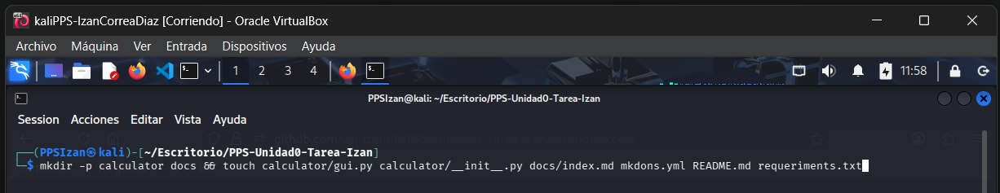
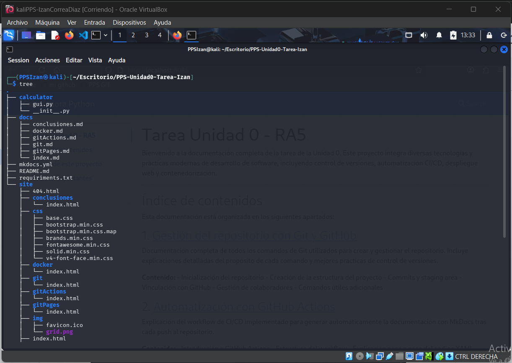
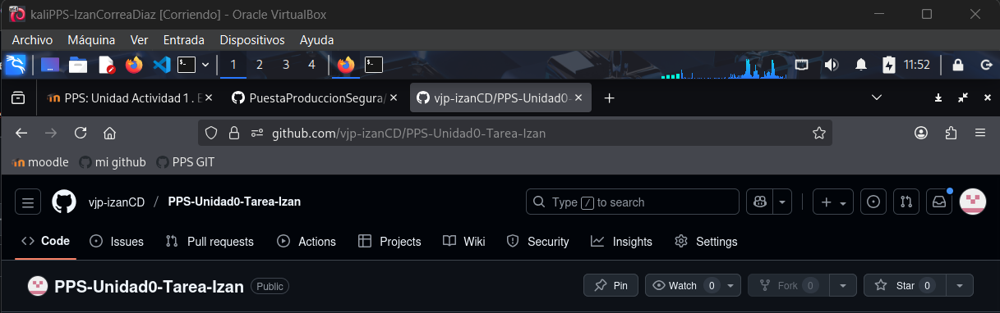
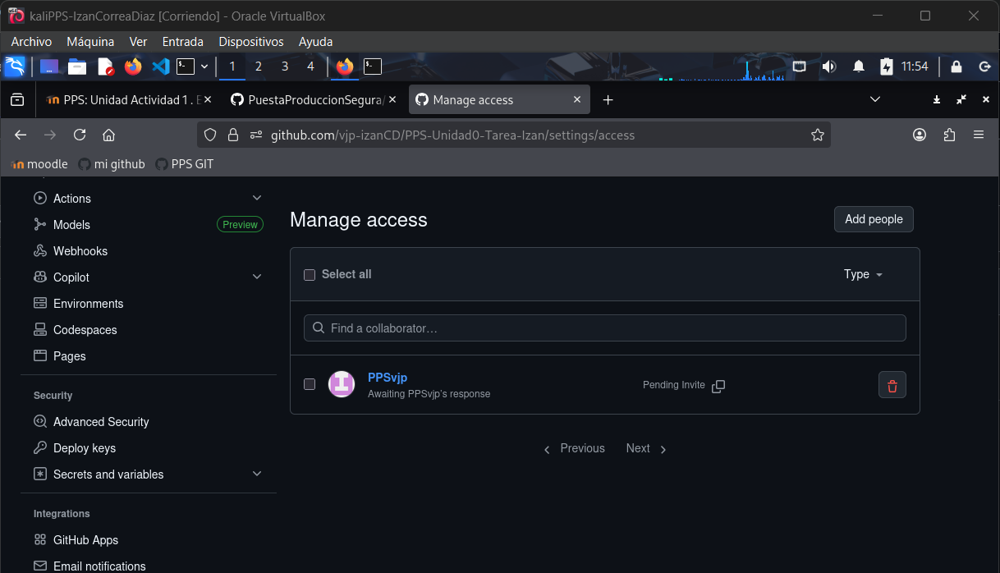

# Gestión del repositorio con Git y GitHub

En este apartado se explican y justifican los comandos utilizados para la creación y gestión del repositorio, así como su vinculación con GitHub.

---

## 1. Creación del repositorio local

### Comando:
```bash
git init
```

### Justificación:
Este comando inicializa un nuevo repositorio local de Git en el directorio actual. Es el punto de partida fundamental para comenzar a trabajar con control de versiones, creando la carpeta oculta `.git` que almacenará toda la información del historial del proyecto.

---

## 2. Estructuración del proyecto

### Comando:
```bash
mkdir -p calculator docs && touch calculator/gui.py calculator/__init__.py docs/index.md mkdocs.yml README.md requiriments.txt
```

**Evidencia:**



### Justificación:
Este comando realiza dos operaciones en una sola línea:
- `mkdir -p calculator docs`: Crea las carpetas `calculator` y `docs` de forma simultánea. El flag `-p` permite crear múltiples directorios y no genera error si ya existen.
- `touch ...`: Crea todos los archivos necesarios vacíos de una sola vez.

Esta práctica demuestra eficiencia en la terminal y permite establecer una estructura profesional del proyecto desde el inicio.

**Estructura del proyecto:**



---

## 3. Añadir archivos al staging area

### Comando:
```bash
git add .
```

### Justificación:
Este comando añade todos los archivos del directorio actual (incluyendo subdirectorios) al área de preparación (staging area). El punto `.` representa el directorio actual, por lo que Git rastreará todos los cambios realizados. Esto prepara los archivos para ser incluidos en el próximo commit.

---

## 4. Realizar el primer commit

### Comando:
```bash
git commit -m "Estructura base del proyecto"
```

### Justificación:
Este comando crea un snapshot (instantánea) del estado actual del proyecto con un mensaje descriptivo. El flag `-m` permite escribir el mensaje del commit directamente en la línea de comando. Un buen mensaje de commit facilita el seguimiento del historial y comunica claramente qué cambios se realizaron.

---

## 5. Creación del repositorio remoto en GitHub

### Pasos:
1. Acceder a [GitHub](https://github.com)
2. Hacer clic en el botón "New" o "+" para crear un nuevo repositorio
3. Nombrar el repositorio siguiendo la nomenclatura requerida: `PPS-Unidad0-Tarea-CorreaDiazIzan`
4. Seleccionar visibilidad pública o privada según los requisitos
5. No inicializar con README (ya lo tenemos localmente)

### Justificación:
GitHub actúa como repositorio remoto, permitiendo:
- **Backup en la nube**: Protección contra pérdida de datos local
- **Colaboración**: Facilita que el profesor y otros colaboradores accedan al proyecto
- **Historial distribuido**: Múltiples copias del historial del proyecto
- **Integración con herramientas**: Permite usar GitHub Actions, Pages, etc.

**Evidencias:**

**Repositorio creado:**



**Colaborador añadido:**



---

## 6. Vincular repositorio local con remoto

### Comando:
```bash
git remote add origin https://github.com/vjp-izanCD/PPS-Unidad0-Tarea-Izan.git
```

### Justificación:
Este comando conecta nuestro repositorio local con el repositorio remoto en GitHub. La palabra `origin` es el nombre convencional que se le da al repositorio remoto principal. A partir de este momento, podemos sincronizar cambios entre ambos repositorios.

---

## 7. Verificar repositorios remotos

### Comando:
```bash
git remote -v
```

### Justificación:
Este comando muestra la lista de repositorios remotos configurados junto con sus URLs para fetch (descarga) y push (subida). Es útil para verificar que la conexión se estableció correctamente.

---

## 8. Subir cambios al repositorio remoto

### Comando:
```bash
git push -u origin main
```

### Justificación:
- `push`: Envía los commits locales al repositorio remoto
- `-u origin main`: Establece la rama `main` del remoto `origin` como rama de seguimiento por defecto
- El flag `-u` (o `--set-upstream`) permite que en futuros push/pull solo necesitemos escribir `git push` sin especificar el remoto y la rama

---

## 9. Añadir colaborador al repositorio

### Pasos:
1. En GitHub, ir a Settings del repositorio
2. Seleccionar "Collaborators" en el menú lateral
3. Hacer clic en "Add people"
4. Buscar y añadir al usuario del profesor: `PPSvjp`
5. Confirmar la invitación

### Justificación:
Añadir al profesor como colaborador es un requisito indispensable de la tarea. Esto le otorga permisos de lectura y escritura en el repositorio, permitiéndole:
- Revisar el código y la documentación
- Clonar el repositorio
- Dejar comentarios y feedback
- Verificar el historial de commits

---

## 10. Comandos adicionales útiles

### Ver estado del repositorio:
```bash
git status
```
Muestra qué archivos han sido modificados, cuáles están en staging y cuáles no están siendo rastreados.

### Ver historial de commits:
```bash
git log
```
Muestra el historial completo de commits con autor, fecha y mensaje.

### Ver historial resumido:
```bash
git log --oneline
```
Muestra el historial en formato compacto, ideal para ver rápidamente la evolución del proyecto.

### Crear y cambiar de rama:
```bash
git checkout -b nombre-rama
```
Crea una nueva rama y cambia a ella inmediatamente.

### Actualizar repositorio local:
```bash
git pull
```
Descarga y fusiona los cambios del repositorio remoto a la rama actual.

---

## Conclusión

El dominio de estos comandos de Git es fundamental para cualquier desarrollador. Permiten:
- Mantener un historial ordenado y documentado del proyecto
- Trabajar de forma colaborativa de manera eficiente
- Revertir cambios cuando sea necesario
- Experimentar con nuevas funcionalidades sin afectar el código principal
- Sincronizar trabajo entre diferentes equipos y ubicaciones

La correcta gestión del repositorio demuestra profesionalismo y buenas prácticas de desarrollo de software.
